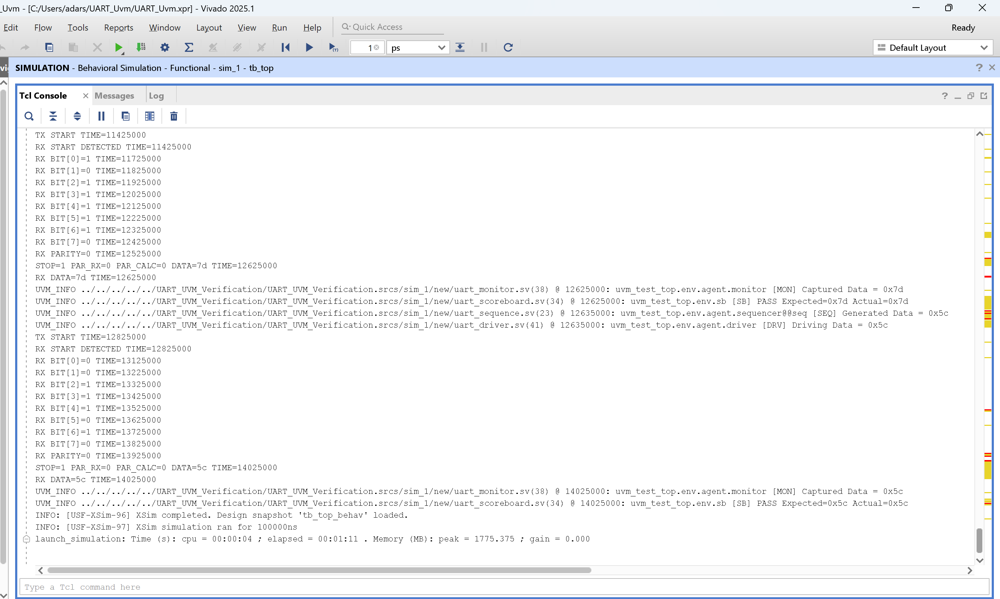
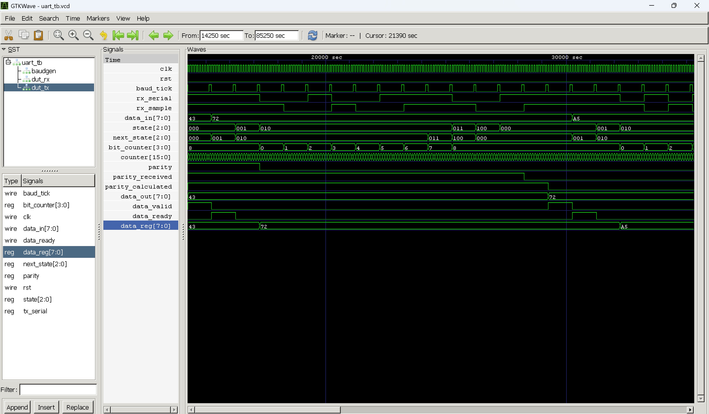

# UART UVM Verification

## Overview

This project implements a complete UVM-based verification environment for a UART (Universal Asynchronous Receiver Transmitter) design.

The verification environment includes:

- UVM Test
- UVM Environment
- UVM Agent
- UVM Driver
- UVM Monitor
- UVM Sequencer
- UVM Sequence
- UVM Scoreboard
- UART Transaction Class
- Functional Checking using Scoreboard

## DUT Features

- UART Transmitter (TX)
- UART Receiver (RX)
- Start Bit Detection
- Data Transmission
- Parity Generation and Checking
- Stop Bit Verification

## Verification Flow

Sequence → Driver → UART DUT → Monitor → Scoreboard

The sequence generates randomized UART transactions.

The driver drives transactions to the DUT through a virtual interface.

The monitor captures received UART data and sends it to the scoreboard.

The scoreboard compares expected and actual data and reports PASS/FAIL.

## Tools Used

- SystemVerilog
- UVM 1.2
- Xilinx Vivado Simulator (XSim)

## Result

## Author

Adarsh Ruppa
